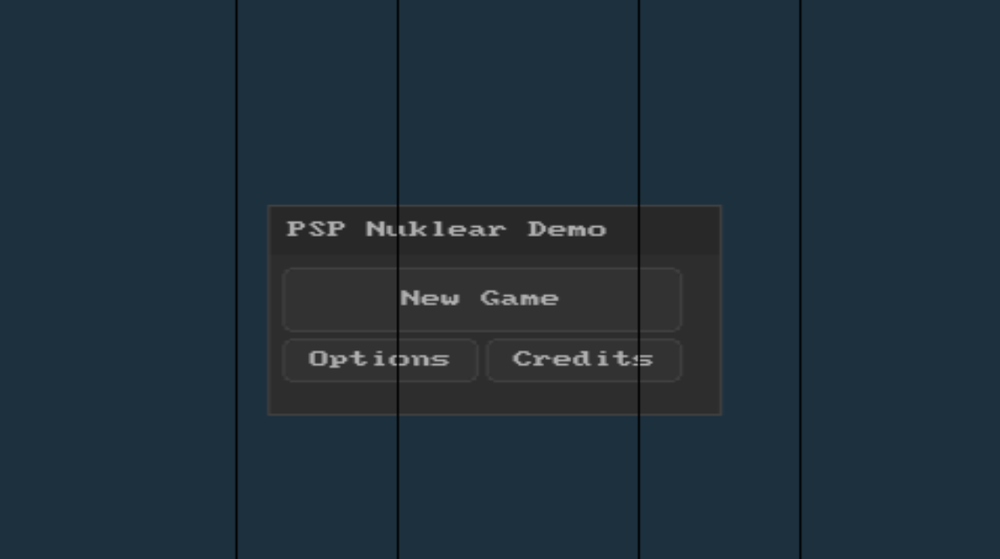

# PSP-Nuklear-SDL-1.2
SDL 1.2 support for Nuklear on the PSP

**This is still a work in progress** hense why it looks like shit, whoever interested please feel free to contriubute :)

PPSSPP:

Hardware:

The SDL 1.2 Nuklear support header was forked from [here](https://github.com/RobLoach/nuklear_sdl_12)

Note: Make sure you replace the "nuklear/nuklear.h" to the latest upsteam.
(Didn't remove it just in case it gets incapatiable overtime. Stupid? maybe *shrug*)
